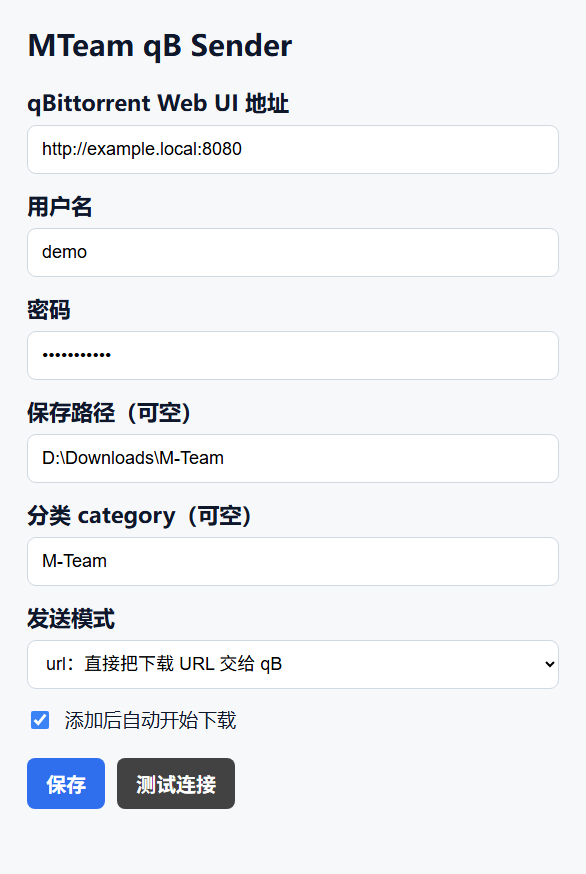
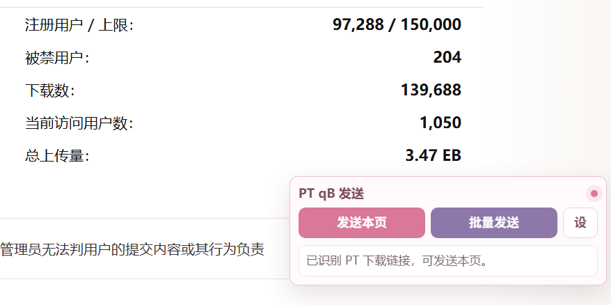

# PT qB Sender

一个用于 PT 站点的 Chrome MV3 扩展，可以把当前种子详情页，或已经打开的多个 PT 种子详情标签页，一键发送到 qBittorrent Web UI。

## 功能

- 只在已启用的内置 PT 站点，或你手动添加的小众 PT 域名上显示右下角发送面板。
- 支持发送当前种子详情页到 qBittorrent。
- 支持批量发送当前 Chrome 中已经打开的 PT 种子详情页。
- 支持在设置页勾选/取消内置主流 PT 站点。
- 支持在设置页手动添加小众 PT 站域名。
- 支持 `upload` 模式：扩展先下载 `.torrent` 文件，再上传到 qBittorrent。
- 支持 `url` 模式：直接把下载链接交给 qBittorrent。
- 兼容 qBittorrent 5.2.x 的 `HTTP 204` 和 `HTTP 202 pending` 响应。

## 默认内置站点

这些站点会在设置页中明文显示，并且可以单独勾选或关闭：

- M-Team：`m-team.io`、`m-team.cc`
- ToTheGlory：`totheglory.im`
- HDHome：`hdhome.org`
- HDSky：`hdsky.me`
- Audiences：`audiences.me`
- KeepFriends：`keepfrds.com`
- HhanClub：`hhanclub.top`
- TJUPT：`tjupt.org`
- PTLSP：`ptlsp.com`
- SpringSunday：`springsunday.net`
- HDArea：`hdarea.club`
- HDDolby：`hddolby.com`

局域网地址、NAS 后台、路由器后台等页面不会因为包含 `details` 或 `download` 字样而自动显示按钮。需要支持小众 PT 站时，请在“自定义小众 PT 站域名”里一行一个添加域名。

## 截图

### 配置页面

### 页面悬浮面板

## 安装

1. 打开 Chrome 的 `chrome://extensions/`。
2. 开启右上角的“开发者模式”。
3. 点击“加载已解压的扩展程序”。
4. 选择本项目里的 `mteam-qb-chrome-extension` 文件夹。
5. 打开扩展配置页，填写 qBittorrent Web UI 地址、用户名和密码。

## 配置说明

推荐使用 `upload` 模式。这个模式会使用当前浏览器登录态下载种子文件，再上传给 qBittorrent，更适合需要登录凭证的 PT 站。

`url` 模式只有在 qBittorrent 能直接访问种子下载链接时才适合使用。

## 使用

打开已启用站点的种子详情页后，右下角会出现悬浮面板：

- `发送本页`：发送当前详情页的种子。
- `批量发送`：扫描当前已打开的已启用站点标签页，并逐个发送。
- `设`：打开扩展配置页。

批量发送会按当前 Chrome 中标签页顺序处理，并自动跳过重复种子。
